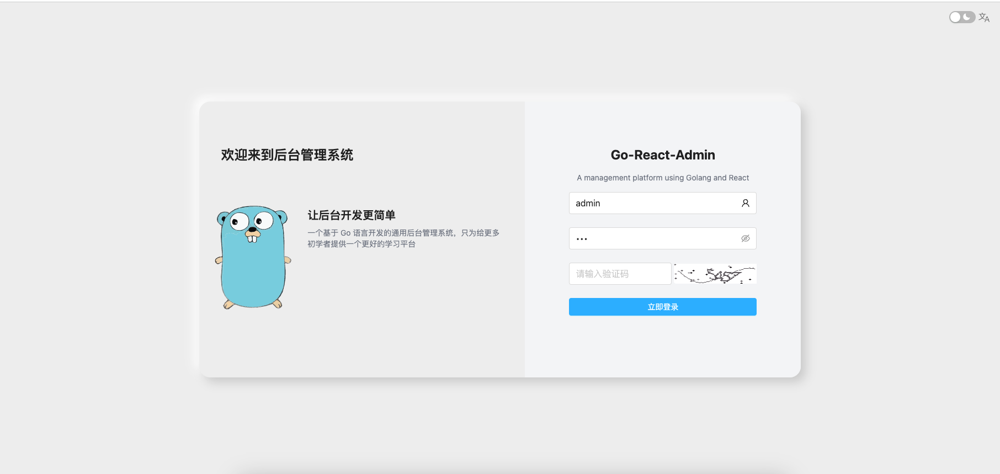
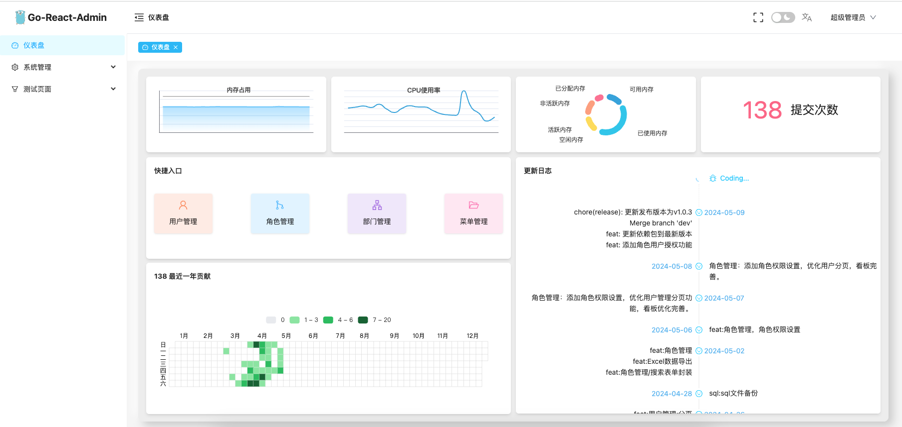
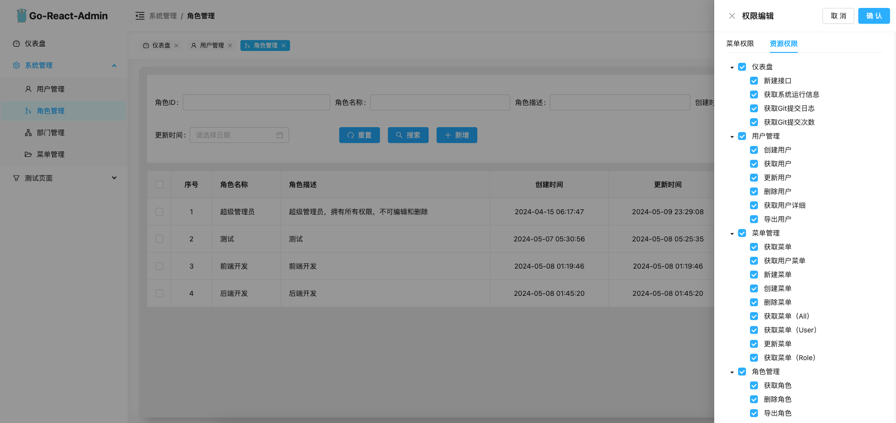

# 基于RBAC的权限管理系统


简体中文 | [English](README_en.md)

[](https://godoc.org/github.com/Xi-Yuer/GO-CMS)


## 项目介绍
基于RBAC的权限管理系统，使用Go + Gin框架，Mysql作为数据库，前端采用 React + Antd 实现。支持国际化，主题色切换，权限控制，菜单管理，用户管理，角色管理，数据字典管理，日志管理，系统监控，代码生成器，接口文档等功能。

## 项目运行后端

1. 克隆项目到本地
   ```text
   https://github.com/Xi-Yuer/GO-CMS.git
   ```
      
2. 安装依赖
    ```text
      cd server
      go mod tidy
    ```

3. 修改运行项目设置环境变量 
   server/config/config.go

         {
           NAME:     "root",  // 数据库用户名
           PASSWORD: "xxxxxx", // 密码
           HOST:     "localhost", // 主机地址
           DB:       "cms", // 数据库名称
           PORT:     "3306", // 端口
         }

4. 创建MySQL运行环境
    1. 创建一个名为 cms 的数据库, 执行SQL文件(位置：server/sql/cms_widthData.sql)

5. 运行项目
    ```text
      go run server/main.go
    ```


## 项目运行前端

1. 克隆项目到本地
   ```text
   https://github.com/Xi-Yuer/GO-CMS.git
   ```
   
2. 安装依赖
    ```text
      cd web
      pnpm install
   ```
   
3. 运行项目
    ```text
      pnpm run dev
   ```

## 项目部分截图





